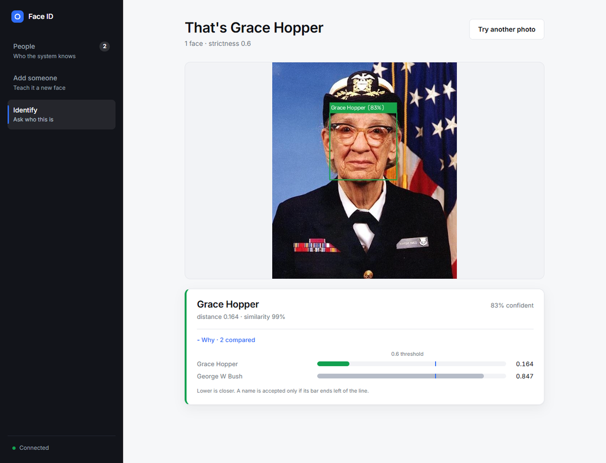
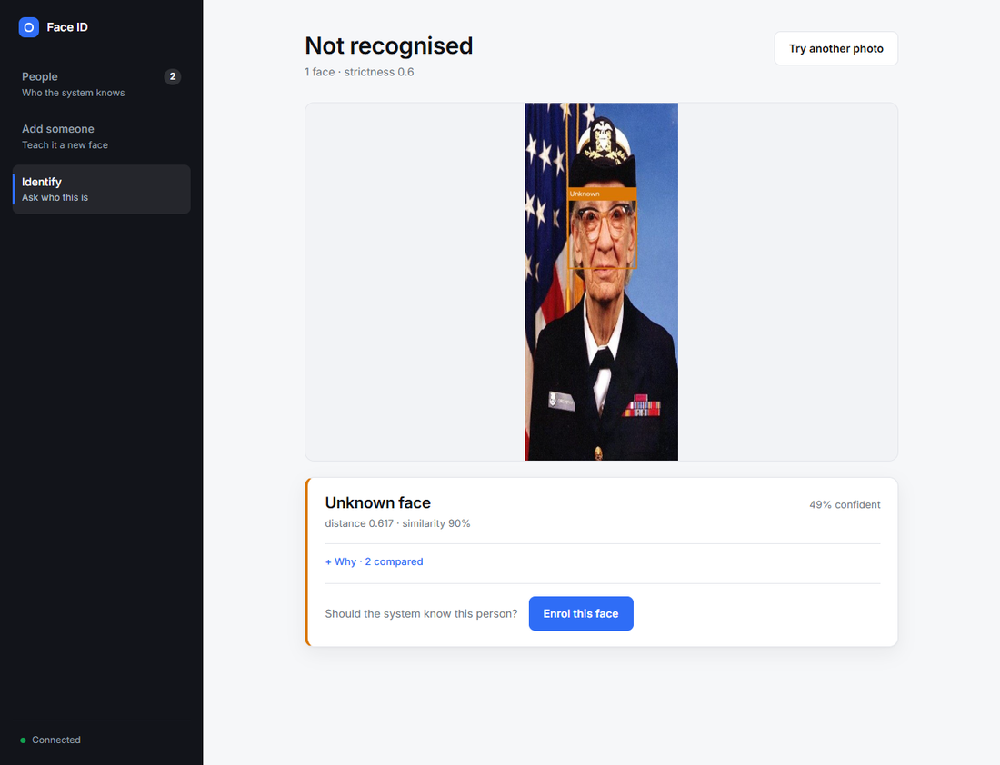
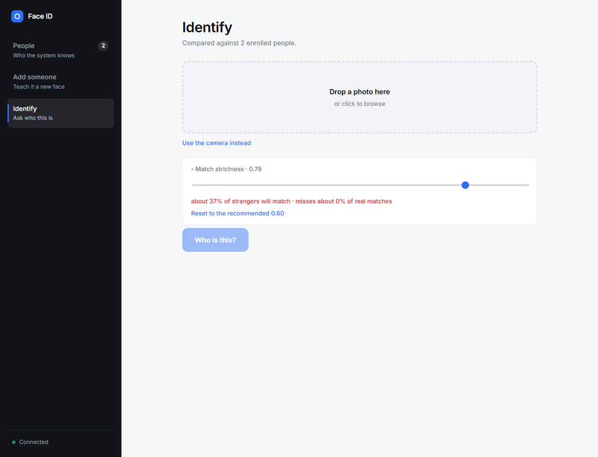
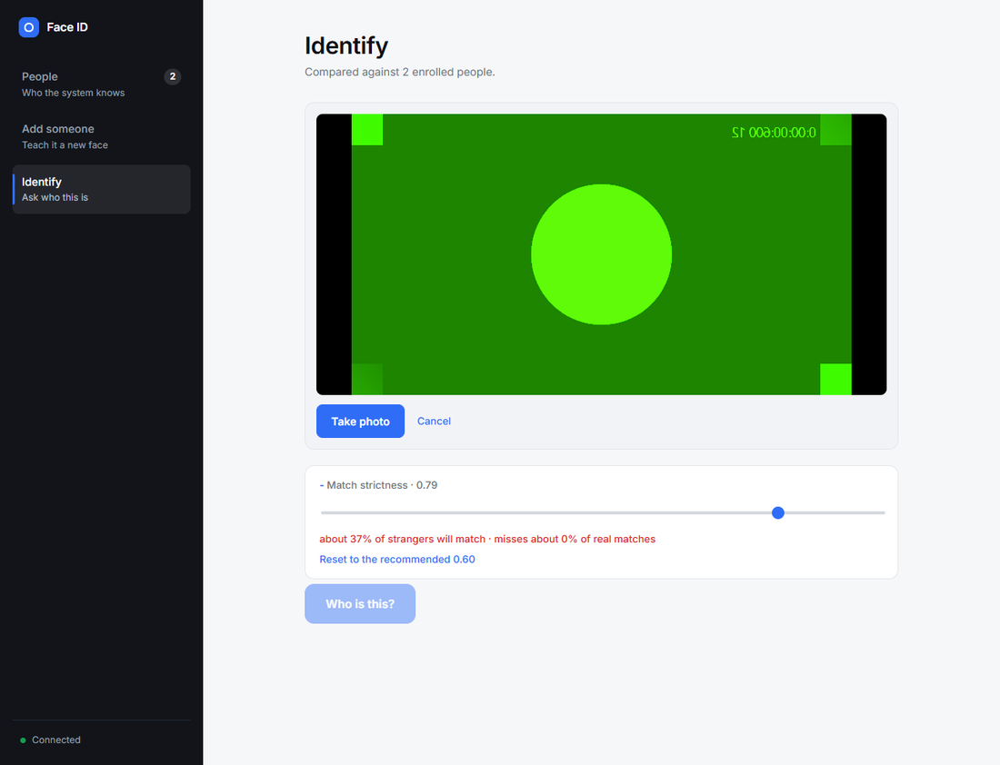
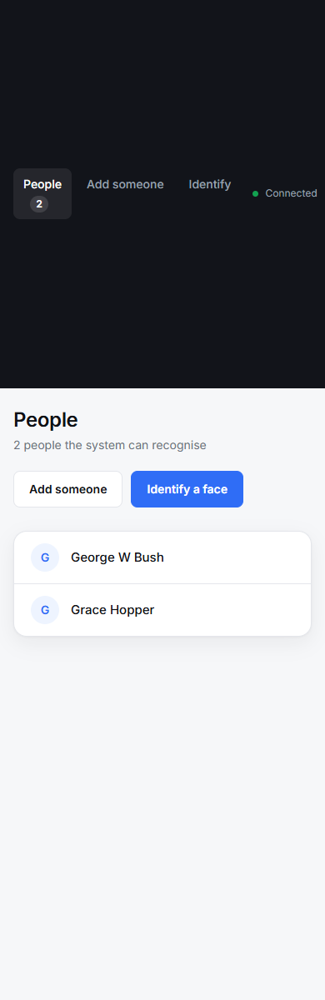

# Face Recognition Identification System

Enroll a person from a photograph, then identify faces in new photographs with
an explicit "unknown" rejection gate. Ships a web UI, a CLI, and a measured
evaluation of how well it actually works.

> **Assignment**: AI/ML Intern — Code Nimbus Solutions
> **Budget**: ₹0 / $0 — every component is free and open source

---

## Measured performance

Two evaluations, both reproducible from this repository, neither tuned to the
numbers it reports.

**1 — The committed test set** ([`Test/`](Test/)): 15 people enrolled from 41
public-domain photographs, then 32 probes identified against them. Every probe
is a *different* photograph from the ones enrolled, and 10 are people who were
never enrolled and must be rejected.

| metric | value |
|---|---:|
| Accuracy | **87.5%** (28/32), 95% CI 71.9–95.0% |
| Precision | 1.00 |
| Recall | 0.82 |
| False accept rate | **0%** |
| False reject rate | 18.2% |

**No stranger was ever accepted**, and every name produced was correct. Four
genuine faces were rejected — all at distances just past the gate, and one
(John Glenn, enrolled from Mercury-era photographs and probed decades later)
farther from himself than several unrelated people are. Loosening the threshold
would recover three of the four on this set, and that change was deliberately
*not* made: see [`Test/README.md`](Test/README.md) for why.

**2 — LFW, at scale** ([`ml/`](ml/)): identities split so nobody in the
evaluation was used to fit anything. Enrolling 3 photographs per person and
averaging them:

| engine | EER |
|---|---:|
| **YuNet + SFace** (default) | **0.44%** |
| dlib ResNet-128 (optional) | 6.14% |

Produced by `python -m ml.aggregation`. Raw output in
[`ml/results/`](ml/results/).

> An earlier version of this README reported 100% on an 8-probe test set. That
> number was an artefact: the dataset's selection rules had been adjusted after
> seeing which probes failed, and 8 probes cannot distinguish 100% from 63%
> anyway. The rules are now frozen, the set is four times larger, and the
> result is reported with its confidence interval.

---

## The interface

Three screens rather than one dashboard, because the three tasks are not
simultaneous: you teach it someone, then you ask it who somebody is, and the
directory is what connects the two.

**First run.** Identification is meaningless against an empty directory, so the
home screen says so and opens enrolment rather than presenting controls that
cannot yet work.


**Adding someone** is a sequence — photographs, then a name. Enrolment decides
how well everything downstream behaves, so it gets its own screen instead of
sharing a panel with an unrelated task.


Finishing offers the obvious next step rather than returning you to a form:


**The directory** is who the system knows.


**Identifying** shows a question, then an answer. Expanding *Why* gives the
distance to every enrolled person against the accept threshold — the gap
between first and second place is what separates a confident result from a
coin toss.



**A face it cannot name** is the one place the product could dead-end, so it
offers to enrol that exact photograph instead.



**Strictness states its own consequences**, measured from 3,000 impostor pairs,
so loosening it is a decision rather than an accident:



**Enrolment and identification also work from the camera**, and the same layout
holds at phone width:

| Camera | 390px |
|---|---|
|  |  |

> Faces shown are Grace Hopper (US Navy photograph, public domain) and an image
> from LFW, the dataset this project benchmarks against.

---

## Beyond the brief

Three additions that go past "enroll and identify":

**Every match explains itself.** The matcher already computed the distance to
every enrolled person and then discarded all but the winner. Results now show
the ranked candidates against the accept threshold, because the gap between
first and second place is what tells you whether to trust a match: 0.41 with a
runner-up at 0.43 is nearly a coin toss, 0.41 against 0.85 is decisive.

**Enroll and identify from the camera.** A capture becomes an ordinary file and
takes the same path as an upload. The preview is mirrored to read like a
mirror but the capture is un-mirrored before upload, or every stored face would
be a flipped version of the person.

**Advisory liveness detection — not a security control.** Face matching cannot
tell a person from a photograph of that person, so a printed photo held to the
camera authenticates as whoever is in it. MiniFASNetV2 (Apache 2.0) scores each
face and flags likely presentation attacks, but **this system does not provide
dependable anti-spoofing** and must not be relied on for one.

It warns rather than blocks, deliberately. Genuine photographs score ~0.62-0.77
live here rather than the 0.95+ a confident detector would give, and brightening
a genuine photo was enough to flip the prediction. The spoof side is also
unvalidated — proving it needs real printed and replayed captures from the
target camera, which we did not have — so the false-reject behaviour is measured
and the false-accept behaviour is not. Gating access on that would reject real
people; promoting it to a hard gate is one line once it has been measured on the
deployment hardware.

---

## Four findings worth reading

**1. Averaging a person's photographs beats keeping them all.** The matcher
originally compared a query against each enrolled photograph and took the
closest. Replacing that with the mean of a person's L2-normalised embeddings
cut the error rate at every enrolment size where the two differ — dlib 8.44% →
6.69% EER at two photographs, SFace 1.47% → 0.74% at five. A
nearest-neighbour rule is only ever as good as the worst photograph somebody
enrolled. Measured by `python -m ml.aggregation`.

**2. The threshold is a property of the pipeline, not a constant.** 0.60 is
dlib's documented default and is correct for nearest-neighbour matching.
Switching to averaging moves the optimum to 0.47 for dlib and 1.012 for SFace.
Both are fitted on validation identities and reported once on test, so the
number is measured rather than inherited.

**3. Training a model on LFW does not beat the pre-trained one.** A CNN with
ArcFace from scratch and an MLP head over frozen embeddings both lost. LFW's
5,819 training images cannot compete with the millions these backbones saw; the
scratch model reached 99.6% training accuracy while its validation AUC fell,
and a 32-configuration ablation found **0 of 32** heads beating the baseline.
Reported rather than buried.

**4. The demo used to claim ~100% accuracy while actually producing F1 = 0.**
It evaluated on synthetic cartoon faces that the detector mostly cannot find,
and silently identified one person as another. `demo.py` now has explicit modes
and the offline one **refuses to report accuracy**, explaining why.

---

## Quick start

No compiler required. The default engine runs through OpenCV's own DNN module.

```bash
pip install -r requirements.txt
cd frontend && npm install && npm run build && cd ..
python app.py                       # http://127.0.0.1:5000
```

On first identification the two ONNX model files (~37 MB) download
automatically into `models/`.

```bash
python -m pytest -q                 # 140 tests
python Test/run_test.py             # the committed test set, with metrics
python cli.py enroll "Alice" photos/alice1.jpg photos/alice2.jpg
python cli.py identify photo.jpg --show
```

Or with Docker, which builds the frontend too:

```bash
docker build -t facerec .           # ~1 minute
docker run -p 7860:7860 facerec
```

Verified on Python 3.14.6 / Windows 11.

---

## Features

| Feature | Details |
|---|---|
| **Face detection** | YuNet (ONNX, MIT) by default — 0 misses on 2,223 LFW test images; dlib HOG/CNN optional |
| **Face embeddings** | SFace 128-d (ONNX, Apache 2.0) by default; dlib ResNet-128 optional |
| **Matching** | Euclidean distance to each person's averaged embedding (equivalent to cosine on unit vectors) |
| **Unknown rejection** | Threshold gate, calibrated against data rather than assumed |
| **Confidence** | Calibrated so the threshold sits at exactly 0.50 — above 50% means accepted |
| **Web UI** | React 18 + Vite, served by Flask |
| **CLI** | `click`-based: enroll / identify / list / remove / stats / evaluate |
| **Evaluation** | AUC, EER, TAR@FAR, FAR/FRR, confusion matrix, threshold sweep |
| **Tests** | 140 pytest cases; every bug fixed here has a named regression test |
| **Training** | PyTorch + ArcFace on identity-disjoint LFW splits ([`ml/`](ml/)) |
| **Storage** | SQLite by default (safe across processes); JSON store retained for inspection |
| **Pluggable engines** | `opencv` (default) or `dlib` ([`docs/UPSTREAM.md`](docs/UPSTREAM.md)) |

### Safety properties worth knowing

- A **group photo is refused at enrolment** rather than storing every face
  under one name, which would silently poison that identity.
- **Embeddings from different engines are never mixed** — the database records
  which model wrote each person and refuses to compare across spaces.
- The server **binds loopback by default**; the API has no authentication, so
  exposing it is an explicit opt-in via `FACEREC_HOST`.

---

## Model & Architecture

```
photograph
    |
    v  YuNet (ONNX, MIT)           detection + 5 facial landmarks
    |
    v  similarity transform        align to SFace's canonical 112x112
    |
    v  SFace (ONNX, Apache 2.0)    128-d L2-normalised embedding
    |
    v  enrolment: average a person's embeddings into one vector
    |  identification: Euclidean distance to each enrolled person
    |
    v  threshold gate              d <= 1.012 -> named,  d > 1.012 -> Unknown
```

### Why these models

| | choice | why |
|---|---|---|
| Detection | **YuNet** | 227 KB, MIT, found a face in 2,223/2,223 LFW test images, and returns the five landmarks alignment needs |
| Embedding | **SFace** | 37 MB, Apache 2.0, 0.44% EER on held-out identities against dlib's 6.14% |
| Runtime | **opencv-python** | both run through `cv2.FaceDetectorYN` / `cv2.FaceRecognizerSF`, already a dependency — no extra package, no compiler |

**Alignment is not optional.** Feeding SFace an unaligned centre crop instead
of the landmark-aligned one costs about four points of accuracy (98.5% → 94.6%
on LFW verification pairs). The first port of this engine scored *worse* than
dlib for exactly that reason.

**dlib remains available** as `engine="dlib"` and is what the `ml/` benchmarks
compare against, but it is no longer a dependency: installing it needs CMake
and a C++ compiler. Run `pip install -r requirements-dlib.txt` if you want it.

### Distance metric

Euclidean distance on L2-normalised embeddings. For unit vectors this is
monotonically equivalent to cosine similarity —

    ||a - b||^2 = 2 - 2*cos(a, b)

— so the two rank identically and a threshold in one converts exactly to the
other: `d <= 1.012` is `cos >= 0.488`. One code path then serves both engines,
including dlib, whose vectors are *not* unit length and whose threshold
therefore lives in a different space.

---

## Matching Threshold

**Default: 1.012** (Euclidean, L2-normalised SFace embeddings, centroid
enrolment). Equivalent to cosine similarity >= 0.488.

Not chosen by hand. `python -m ml.aggregation --fit` enrols LFW *validation*
identities at one to five photographs each, sweeps the threshold, and takes the
value that works across enrolment sizes. Those identities appear in neither
training nor the test split, so the number is not fitted to what it is scored
on.

| engine | aggregation | fitted threshold |
|---|---|---:|
| YuNet + SFace | centroid | **1.012** |
| dlib | centroid | 0.472 |
| dlib | nearest | 0.600 (the library default) |

The threshold moves with the aggregation strategy, which is why there is no
single "correct" number to quote: averaging a person's photographs pulls
genuine distances inward, so the gate must move with them.

Measured error rates near the operating point (validation identities,
`ml/results/error_curves.json`):

| threshold | strangers accepted | genuine faces missed |
|---:|---:|---:|
| 0.75 | 0% | 48% |
| **1.012** | **~0%** | **~4%** |
| 1.22 | 73% | 0.6% |

The interface reads this curve from `/api/config` and states the consequence of
whatever the slider is set to, rather than showing a bare number.

---

## Project Structure

```
face-recognition-system/
├── src/
│   ├── __init__.py
│   ├── detector.py       # FaceDetector — HOG/CNN face bounding boxes
│   ├── embedder.py       # FaceEmbedder — 128-d dlib ResNet encodings
│   ├── database.py       # FaceDatabase — JSON persistence, CRUD
│   ├── matcher.py        # FaceMatcher — NN matching + threshold gate
│   ├── system.py         # FaceRecognitionSystem — high-level facade
│   └── evaluator.py      # Evaluator — metrics, plots, reports
├── frontend/             # React 18 + Vite source
│   ├── index.html
│   └── src/
│       ├── App.jsx
│       ├── index.css
│       └── components/   # Header, EnrollForm, PersonList, IdentifyPanel, ResultsPanel
├── static/dist/          # Built frontend, served by Flask (npm run build)
├── tests/
│   ├── test_matcher.py   # matching, thresholds, confidence, JSON safety
│   ├── test_database.py  # persistence, atomic writes, concurrency
│   ├── test_api.py       # HTTP contract (recognition stubbed)
│   └── test_pipeline.py  # end-to-end against real dlib models
├── database/
│   └── enrolled_faces.json   # Persistent enrollment store (auto-created)
├── evaluation/
│   ├── confusion_matrix.png  # Generated after evaluation
│   ├── threshold_sweep.png   # Generated after sweep
│   └── evaluation_report.json
├── sample_data/          # Auto-generated demo images
├── app.py                # Flask web application
├── cli.py                # CLI entry point
├── demo.py               # End-to-end demo script
├── generate_sample_data.py   # Synthetic data generator
├── requirements.txt
└── README.md
```

---

## Detailed setup and usage

### 1. Install dependencies

```bash
# Create virtual environment (recommended)
python -m venv venv
source venv/bin/activate    # Linux/macOS
venv\Scripts\activate       # Windows

# Install dependencies
pip install -r requirements.txt
```

> **Note on `setuptools`**: `face_recognition_models` imports `pkg_resources`, which
> setuptools removed in version 81. `requirements.txt` pins `setuptools<81` for this
> reason. If you see `ModuleNotFoundError: No module named 'pkg_resources'`, run
> `pip install "setuptools<81"`.

> **Note (Windows/macOS)**: `face_recognition` requires `dlib`. If `pip install` fails:
> - **Windows**: `pip install dlib` (requires CMake + Visual Studio Build Tools), or install pre-built wheel:  
>   `pip install https://github.com/jloh02/dlib/releases/download/v19.22/dlib-19.22.0-cp311-cp311-win_amd64.whl`  
> - **macOS**: `brew install cmake && pip install dlib`
> - **Linux**: `sudo apt install cmake libopenblas-dev && pip install dlib`

### 2. Run the demo

```bash
python demo.py --data-dir photos/   # real photos you supply — the meaningful demo
python demo.py --lfw                # real faces from LFW (downloads ~200 MB once)
python demo.py --smoke              # offline pipeline check, reports no accuracy
```

`--data-dir` expects `photos/<Person Name>/*.jpg` for enrolment and `photos/probe/*.jpg`
for queries; a probe named `Alice_01.jpg` is expected to identify as `Alice`, and anything
starting with `unknown` is expected to be rejected.

`--smoke` deliberately prints no accuracy figures. Its synthetic images are OpenCV
drawings: dlib detects a face in only a handful of them, and those few are nearly
identical to one another, so any score would describe the drawing code rather than this
system. Use `--data-dir` or `--lfw` for numbers that mean something.

### 3. Launch the Web UI

```bash
cd frontend && npm install && npm run build && cd ..
python app.py
# Open http://127.0.0.1:5000
```

For frontend development, run `npm run dev` (port 5173) alongside `python app.py`;
Vite proxies the API routes to Flask.

The server binds loopback only. The API has no authentication, so exposing it on a
network means anyone there can enroll, identify and delete people. Opt in deliberately:

```bash
FACEREC_HOST=0.0.0.0 FACEREC_SECRET="$(python -c 'import secrets;print(secrets.token_hex(32))')" python app.py
```

### 4. Optional: the faster, more accurate engine

```python
from src.system import FaceRecognitionSystem
system = FaceRecognitionSystem(engine="opencv")   # YuNet + SFace, downloads 37 MB once
```

Measured on 462 held-out LFW identities: EER 1.83% vs dlib's 2.67%, accuracy
98.50% vs 97.50%, TAR@FAR=0.1% 96.8% vs 90.3%, and ~6x the throughput with no
dlib dependency. Embeddings are not interchangeable between engines, so switching
requires re-enrolment — the database records which engine wrote each person and
refuses to mix them. Survey and measurements in [`docs/UPSTREAM.md`](docs/UPSTREAM.md).

### 5. Use the CLI

```bash
# Enroll a person
python cli.py enroll "Alice" path/to/alice1.jpg path/to/alice2.jpg

# Identify a face
python cli.py identify path/to/test.jpg --show

# List enrolled persons
python cli.py list

# Remove a person
python cli.py remove "Alice"

# Evaluate against a probe CSV
python cli.py evaluate probes.csv --sweep

# Database stats
python cli.py stats
```

---

## Evaluation

### How to produce numbers

```bash
python demo.py --lfw                        # real faces, end-to-end
python cli.py evaluate probes.csv --sweep   # your own labelled probe set
```

`probes.csv` has two columns, `image_path,label`, where `label` is the enrolled name
for a genuine probe or `Unknown` for an impostor.

Both write to `evaluation/`:

- `confusion_matrix.png` — per-class confusion
- `threshold_sweep.png` — FAR/FRR and F1/Accuracy vs threshold
- `evaluation_report.json` — per-probe detail plus the summary

### Measured results

Benchmarked on **LFW**, 462 held-out identities that appear in no training
split, 6,000 balanced verification pairs. Full protocol and code in
[`ml/README.md`](ml/README.md).

| approach | AUC | EER | accuracy | TAR@FAR=0.1% |
|---|---:|---:|---:|---:|
| **dlib ResNet-128 (shipped)** | **0.9954** | **2.67%** | **97.50%** | **90.3%** |
| MLP head trained over dlib | 0.9881 | 4.13% | 96.63% | 85.2% |
| CNN + ArcFace, from scratch | 0.9057 | 17.90% | 82.80% | 29.4% |

At the shipped threshold of 0.60: **97.10% accuracy, 0.63% FAR, 5.17% FRR.**

Two findings worth stating plainly:

- **Neither trained model beat the pre-trained backbone.** LFW's 5,819 training
  images cannot compete with the ~3M faces dlib was trained on; the from-scratch
  model hit 99.6% training accuracy while its validation AUC fell. A 32-config
  ablation found **0/32** head configurations beating plain dlib on validation.
- **The 0.60 threshold is empirically correct.** Fitting it from data lands on
  0.605. A constant inherited from library documentation turned out to be right,
  and there is now a measurement saying so.

> **No synthetic-data accuracy is claimed.** An earlier version of this README reported
> ~100% accuracy and F1 ≈ 1.00 on the synthetic cartoon probes. Those numbers were never
> reproducible: running that demo actually yielded **F1 = 0.0000**, with one "person"
> silently identified as another, because dlib cannot reliably detect drawn faces and the
> few it does detect are nearly identical. The synthetic path is now a plumbing check
> only — see `python demo.py --smoke`.

---

## Tests

```bash
pip install pytest
python -m pytest -q          # 65 tests
```

| File | Covers |
|---|---|
| `test_matcher.py` | centroid vs nearest aggregation, threshold gating, confidence calibration, JSON safety |
| `test_database.py` | round-trips, atomic writes, concurrent enrolment, corrupt-payload handling |
| `test_api.py` | every HTTP route and error path, with recognition stubbed so it runs without dlib |
| `test_pipeline.py` | the real dlib pipeline on a real photograph; skips itself if models are absent |

Each regression above has a named test, so the bugs they describe cannot return silently.

---

## Known Failure Cases

| Scenario | Issue | Mitigation |
|---|---|---|
| **Extreme pose** (>45° yaw) | dlib detector misses face or embedding degrades | Enroll multiple angles |
| **Low resolution** (<80×80 px) | Poor embedding quality | Upscale before detection (`upscale=2`) |
| **Heavy occlusion** (mask, glasses) | Detection/embedding degrades | Lower threshold or use CNN model |
| **Near-identical twins** | Very similar embeddings → misidentification | Lower threshold + more enrollment images |
| **Bright backlighting** | Over-exposure → detection failure | Pre-process: histogram equalisation |
| **Partial face at image edge** | Truncated bounding box → bad embedding | Crop with padding |
| **Very large group photos** | Slow, some small faces missed | Use `upscale=2`, CNN model |
| **Group photo at enrolment** | Every face would be stored under one name | Refused by default; pass `require_single_face=False` to override |
| **Same person, two spellings** | "alice" and "Alice" become two people | Web enrolment folds new names into an existing case-insensitive match |
| **Many enrolled people** | Matching is O(people × embeddings) per query | Fine to a few thousand; use FAISS beyond that |
| **Unauthenticated API** | Anyone who can reach the port can enroll or delete | Binds loopback by default; put a reverse proxy and auth in front before exposing |

---

## Configuration

All key parameters can be overridden in `FaceRecognitionSystem`:

```python
from src.system import FaceRecognitionSystem

sys_ = FaceRecognitionSystem(
    engine="opencv",          # "opencv" (YuNet + SFace) or "dlib"
    distance_metric="euclidean",  # "euclidean" or "cosine"
    threshold=None,           # None -> the engine's fitted default (1.012)
)
```

---

## Future Improvements

1. **Better model**: Replace dlib with ArcFace / FaceNet (InsightFace) for higher accuracy
2. **GPU acceleration**: Enable CUDA for CNN detection + embedding
3. **Anti-spoofing**: Add liveness detection to reject photos/videos
4. **Incremental re-training**: Fine-tune embeddings on enrolled data
5. **Vector DB**: Replace JSON with FAISS/Qdrant for sub-millisecond search at scale
6. **Authentication**: the API is currently unauthenticated — add tokens before any shared deployment
7. **Face clustering**: Auto-cluster unknown probes (useful for de-identification)
8. **Data augmentation**: Generate augmented embeddings (flip, brightness, rotation) at enroll time

---

## API Reference

### `FaceRecognitionSystem`

```python
sys_ = FaceRecognitionSystem(...)

# Enrollment — returns EnrollOutcome(enrolled, faces_found, reason)
# A photo with more than one face is refused unless require_single_face=False,
# so a group photo cannot silently store strangers under one name.
sys_.enroll_from_image(name, image_path, require_single_face=True) → EnrollOutcome
sys_.enroll_from_array(name, rgb_array, require_single_face=True) → EnrollOutcome
sys_.enroll_from_directory(name, directory) → int

# Identification — threshold overrides the gate for this call only
sys_.identify_from_image(image_path, threshold=None) → list[(bbox, MatchResult)]
sys_.identify_from_array(rgb_array, threshold=None) → list[(bbox, MatchResult)]

# Visualisation
sys_.annotate_image(rgb_array, results) → np.ndarray

# Database
sys_.list_enrolled() → list[str]
sys_.remove_person(name) → bool
sys_.db_stats() → dict
```

### `MatchResult`

```python
result.name         # "Alice" or "Unknown"
result.distance     # Euclidean distance (lower = more similar); inf if nothing enrolled
result.similarity   # Cosine similarity (higher = more similar)
result.is_known     # True if accepted, False if rejected
result.confidence() # Float [0,1], calibrated so the threshold sits at exactly 0.50
result.to_dict()    # JSON-safe dict; non-finite values become null
```

**Confidence is threshold-relative.** `confidence()` returns `0.5 ** (distance / threshold)`:
0 distance reads 1.00, a match exactly on the threshold reads 0.50, and twice the threshold
reads 0.25. So "above 50%" always means accepted, whatever threshold is in force. The
previous `exp(-2.5 · distance)` curve put the threshold at 0.22, which made a solid match
report 66% and contradicted its own docstring.

**`to_dict()` never emits `Infinity` or `NaN`.** Those are not valid JSON, and browsers
throw on `JSON.parse`. Identifying with an empty database used to return
`{"distance": Infinity}` and break the web UI on a new user's very first action; distance
is now `null` with a `no_candidates: true` flag.

---

## Dependencies (All Free)

| Package | Purpose | License |
|---|---|---|
| `face_recognition` | dlib face detection + embeddings | MIT |
| `dlib` | ResNet face model (bundled) | Boost |
| `opencv-python` | Image I/O + visualisation | Apache 2 |
| `numpy` | Numerical operations | BSD |
| `Flask` | Web interface | BSD |
| `scikit-learn` | Evaluation metrics | BSD |
| `matplotlib` + `seaborn` | Plots | PSF / BSD |
| `click` | CLI framework | BSD |
| `Pillow` | Image format support | HPND |
| `tqdm` | Progress bars | MIT |

**Total cost: ₹0 / $0**

---

## How to add real photos

1. Create a folder per person:
   ```
   photos/
     Alice/  alice_1.jpg  alice_2.jpg  alice_3.jpg
     Bob/    bob_1.jpg    bob_2.jpg
   ```
2. Enroll all at once:
   ```bash
   python cli.py enroll "Alice" photos/Alice/*.jpg
   python cli.py enroll "Bob"   photos/Bob/*.jpg
   ```
3. Identify any new photo:
   ```bash
   python cli.py identify test.jpg --show
   ```

---

*Built for Code Nimbus Solutions AI/ML Intern Assignment · September 2026*
