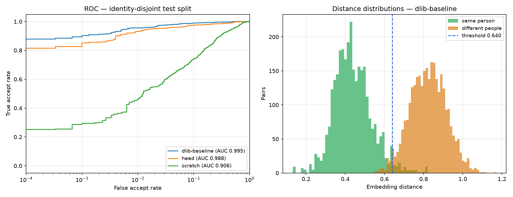

# Model training and evaluation

This directory contains the dataset pipeline, two training tracks, and the
benchmark that compares them against the embeddings the product ships.

**Headline result: neither trained model beats the pre-trained dlib backbone,
and the benchmark says so plainly.** That is the honest outcome of training on
LFW, and the reasoning is below. What the work *did* produce is a measured
accuracy figure for the deployed system (97.10%) and independent confirmation
that its 0.60 threshold is correctly placed.

---

## Reproducing

```bash
pip install torch torchvision      # CUDA build: --index-url https://download.pytorch.org/whl/cu126
python -m ml.prepare               # download LFW, split, cache embeddings (~12 min once)
python -m ml.train --track head    # ~20 s
python -m ml.train --track scratch # ~10 min on an RTX 3050
python -m ml.benchmark             # scores everything on the test split
python -m ml.calibrate             # fits the rejection threshold
python -m ml.sweep_head            # 32-config ablation: does a head help?
```

`ml/cache/` (≈350 MB) and `ml/checkpoints/` are generated, not committed.

---

## Dataset and protocol

**Labeled Faces in the Wild**, via `sklearn.datasets.fetch_lfw_people`
(9,164 images, 1,680 identities with ≥2 photographs).

The split is **by identity, never by image**:

| split | identities | images |
|---|---:|---:|
| train | 657 | 5,819 |
| test | 462 | 2,223 |

A validation slice (98 identities) is carved out of the *training* identities
for early stopping and threshold fitting, so the test split is scored exactly
once per model.

This matters more than any modelling choice. Face recognition is open-set: the
deployed system meets people it never trained on. Splitting by image instead of
identity lets a model memorise faces it will be scored on, which inflates
accuracy into the high nineties regardless of whether anything was learned.
Identities are assigned to splits by a SHA-1 hash of the name, so the partition
is identical on every machine and every run — Python's `hash()` is randomised
per process and would silently reshuffle the benchmark.

Evaluation uses 6,000 balanced verification pairs (3,000 genuine / 3,000
impostor) drawn once with a fixed seed, so every model is scored on exactly the
same comparisons.

---

## Results

Test split: 462 unseen identities, 6,000 pairs.

| approach | AUC | EER | accuracy | TAR@FAR=1% | TAR@FAR=0.1% | d′ |
|---|---:|---:|---:|---:|---:|---:|
| **dlib-baseline** (shipped) | **0.9954** | **2.67%** | **97.50%** | **95.6%** | **90.3%** | **4.08** |
| head (MLP over dlib) | 0.9881 | 4.13% | 96.63% | 93.1% | 85.2% | 4.00 |
| scratch (CNN + ArcFace) | 0.9057 | 17.90% | 82.80% | 46.2% | 29.4% | 1.79 |



Thresholds are comparable within a row, not across rows: dlib is scored on its
raw vectors (where its 0.60 default lives) and the ArcFace models on the unit
sphere their loss operates on. AUC, EER and TAR@FAR are scale-free, so the
cross-model comparison uses those.

### Why the from-scratch model loses

It reached **99.6% training accuracy** while validation AUC peaked at epoch 15
and then fell — textbook overfitting. 5,819 images across 657 identities is
simply not enough signal to learn a general face metric; dlib's backbone saw
roughly 3 million faces. The gap is dataset size, not architecture, and no
amount of regularisation closes three orders of magnitude of data.

Building it was still worthwhile: it is a complete, working ArcFace pipeline,
and it quantifies exactly what the pre-trained model buys you (AUC 0.906 →
0.995).

### Why the head loses — and how we made sure

The first head looked like a win: validation AUC improved from 0.9927 to 0.9940
over training. On the test identities it scored *worse* than plain dlib. That
is the signature of selecting on noise.

`ml/sweep_head.py` settles it properly — 32 configurations (learning rate,
weight decay, width, margin, input jitter), each scored on validation only,
with plain dlib measured on the **same** validation pairs as a control:

```
plain dlib,  validation AUC  : 0.9958
best head,   validation AUC  : 0.9952  (-0.0006)
configs beating dlib on val  : 0/32
```

Zero of thirty-two. The single best-on-validation configuration was then scored
once on test: AUC 0.9856 versus dlib's 0.9954. A learned head over frozen dlib
embeddings does not help on this data.

---

## Threshold calibration

`python -m ml.calibrate` fits the rejection threshold on validation identities
and reports it once on test:

| operating point | threshold | accuracy | FAR | FRR |
|---|---:|---:|---:|---:|
| shipped default | 0.600 | 97.10% | 0.63% | 5.17% |
| fitted on validation | 0.605 | 97.18% | 0.70% | 4.93% |
| oracle (best on test) | 0.640 | 97.50% | 2.30% | 2.70% |

**The shipped 0.60 is right.** Fitting from data lands on 0.605 — a 0.005
difference, well inside noise. This is a negative result in the useful sense:
a hardcoded constant inherited from library documentation turns out to be
empirically correct, and now there is a measurement saying so rather than an
assumption.

`src.matcher.calibrated_threshold()` reads `results/threshold.json` if present,
so re-running calibration on your own population takes effect without a code
change.

### A bug worth recording

The first calibration run reported a **67% false-accept rate** at threshold
0.60 and concluded the product was catastrophically mis-tuned. That was wrong,
and the error was in the evaluation code, not the product.

dlib's 128-d vectors are **not unit length** (‖v‖ ≈ 1.42). `src.matcher`
compares raw vectors, which is the space dlib's 0.60 default is defined in. The
evaluation helper L2-normalised first, shrinking every distance by ~1.42× and
making a correctly-placed threshold look absurdly permissive. `pair_distances`
now takes an explicit `normalize` flag, the choice is documented per model, and
`tests/test_ml.py` pins the behaviour.

---

## Files

| file | purpose |
|---|---|
| `data.py` | LFW loading, identity-disjoint splitting, pair generation |
| `embed.py` | cached dlib embeddings, parallelised over processes |
| `prepare.py` | one-shot artefact build (`python -m ml.prepare`) |
| `models.py` | ArcFace margin head, from-scratch CNN, residual embedding head |
| `train.py` | training loop for both tracks, with per-epoch verification AUC |
| `evaluate.py` | AUC, EER, TAR@FAR, threshold selection, plots |
| `benchmark.py` | scores every approach on the shared test split |
| `calibrate.py` | fits the deployable rejection threshold |
| `sweep_head.py` | 32-config ablation with a like-for-like dlib control |

---

## What would actually improve accuracy

In rough order of return on effort:

1. **A real training corpus.** CASIA-WebFace (~0.5M images) or VGGFace2 (~3.3M).
   The from-scratch track is bottlenecked on data, not code — the same pipeline
   would produce a genuinely competitive model.
2. **A stronger pre-trained backbone.** InsightFace/ArcFace R100 reaches ~99.8%
   on LFW against dlib's 99.38%, and is a drop-in replacement for `FaceEmbedder`.
3. **Better alignment.** Five-point similarity alignment before embedding
   typically buys 0.5–1% over the centre crop used here.
4. **Test-time augmentation.** Averaging an image with its mirror is a free
   ~0.2%.

Fine-tuning the *backbone* on your own enrolled population — rather than
bolting a head on frozen features — is the one local-data approach with real
headroom, but it needs far more than the few photographs per person that
enrolment collects.
